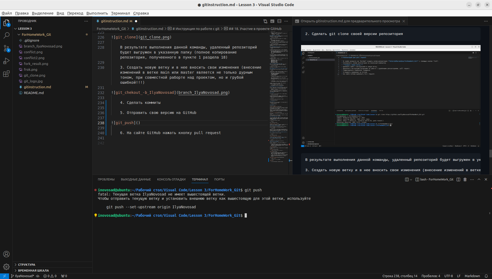

# Инструкция по Git #
1. ## Проверка наличия установленного Git ##
В терминале выполняем команду git --version. Если git установлен, то появится сообщение с информацией о версии файла. Иначе будет сообщение об ошибке

2. ## Установка git ##
Загружаем последнюю версию git с сайта: https://git-scm.com/

3. ## Настройка git ##
При первом использовании git необходимо представиться. Для этого надо ввести две коанды: git config --global user.name git config --global user.email
Для того чтобы проверить прошла ли регистрация надо ввести команду: git config --list

4. ## Инициализация Ропезетория ##
Прописываем в терминале git init.
В исходной папке появится скрытая папка .git

5. ## Команды для домашки ##
_git status_ - отображает состояние рабочего каталога и раздела проиндексированных файлов. 
С ее помощью можно проверить индексацию изменений и увидеть файлы, которые не отслеживаются Git. 
Информация об истории коммитов проекта не отображается при выводе данных о состоянии. 
Для этого используется команда git log. git tag Теги — это ссылки, указывающие на определенные точки в истории Git. 

_Команда_: git status

_git add_ - это первая команда в цепочке операций, предписывающей Git «сохранить» снимок текущего состояния проекта в истории коммитов. 
Когда git add используется как отдельная команда, она переносит ожидающие изменения из рабочего каталога в раздел проиндексированных файлов. 
Команда git status проверяет текущее состояние репозитория; с ее помощью можно убедиться, что команда git add добавила нужные изменения. 

_Команда_: git add (пробел, далее нажимая TAB ищем название нашего файла)

_git commit_- это команда Git для записи индексированных изменений в репозиторий. 
Используйте эту метку для обозначения всех вопросов, связанных с созданием, редактированием и внутренней структурой коммитов в Git. 
Прежде чем создавать очередной коммит, необходимо проиндексировать файлы в рабочей области с помощью команды git (пробел) add. 

_Команда_: git commit -m 'Add some code'
как только однажды ввели git add_ , в дальнейшем вводим: git commit -am 'Комментарий'

_git log_ - разнообразная информация о коммитах в целом, по отдельным файлам и различной глубины погружения в историю. 
Иногда требуется получить информацию об истории коммитов, коммитах, изменивших отдельный файл; коммитах за определенный отрезок времени и так далее. 

_Команда_: git (пробел) log

_git diff_ - команды git status и git diff (от слова difference - разница) позволяют отслеживать все изменения в проекте.
git diff. Это команда для просмотра изменений в файлах. В терминале мы видим добавленные и удаленные строки. 

_Команда_: git diff (индекс изменений) 09bd8cc..ba25c0ff

_git checkout_ - в Git под термином checkout подразумевают переключение между различными версиями целевого объекта. 
Команда git checkout работает с тремя различными объектами: файлами, коммитами и ветками. 
Под переключением также обычно понимают действие, связанное с выполнением команды git checkout.

_Команда_: git checkout

_git config --list_ - для того, чтобы посмотреть все настройки системы

6. ## Добавление картинок и игнорирование файлов ##
Для того чтобы разместить картинку в нашем файле надо добавить ее в папку и после этого в нужном месте пишем следущее: 

Для того чтобы удалить файлы с изображением из отслеживания надо создать файл .gitignore

7. ## Ветвление ##
Для создания новой ветки надо ввести в терминале _комаду_: git branch name_branch(название_ветки)
А чтобы создать новую ветку и сразу на нее перейти _команда_: git checkout -b name_branch(название_ветки)

Ветвление необхимо для работы с файламив отдельной ветке, сохраняя при этом исходное состояние файла до их слияния! 
Чтобы отобразить созданные ветки, используется _команда_: git branch 
Чтобы перейти на другую ветку используем _команду_: 
git checkout name_branch

Чтобы посмотреть все ветвления _команда_: git log --graph

8. ## Слияние веток ##
Для слияния веток и внесение изменений в наш основной файл используется команда: git merge name_branch 
Слияние делается в ту ветку, в которой сейчас находимся

9. ## Конфликты ##
При слиянии ветов возможны конфликты. При конфликтах появляется ОШИБКА и выводится консоль с предложениями для решения конфликта.
Выбираешь из 4-х вариантов удобный для тебя 

10. ## Дополнительные команды ##
git clear - очистить терминал (так проще работать)
 
11. ## Работа с удаленными репозиториями ##

- захожу на Github по ссылке удаленного репозитория 
- нажимаю кнопку "Fork"

- открывается странины "Create a new fork" и убираю "галочку" с 'Copy the master... '
- нажимаю кнопку 'Create fork'

- репозиторий появляется на моей странице git hub
	* или заходишь в меню - 'Your Repositories' - открывается экран, где нажимаешь нужный репозиторий

- нажимаю на кнопку 'Code'

- нажимаю "копировать ссылку"

- перехожу в VSCode
- создаю / открываю пустую папку
- ввожу в Терминале git clone и вставляю копированную ссылку - появляются рабочие папки данного репозитория
- нажимаю на название папки правой клавишей мыши и в открывшемся меню нажимаю "Открыть во встроенном терминале"

- создаю свою ветку (в идеале называть по своему имени)
_команда_: git checkout -b name_branch
- проверяю, что нахожусь на нужной ветке 

- не забудь комиты, чтобы ничего не потерять
- вводим _команду_: git push
- появляется ошибка. В этой ошибку прописыватся системой правильная команда - ее копируем и втсавляем в терминал

- бегу в Github, обновляю страницу
- 
- чтобы картинки тоже перенелись сотри из .gitignore расширения картинок введи в терминале команду git add .

НО эту команду вводи, когда точно уверена, что все сделала и добавила все картинки

