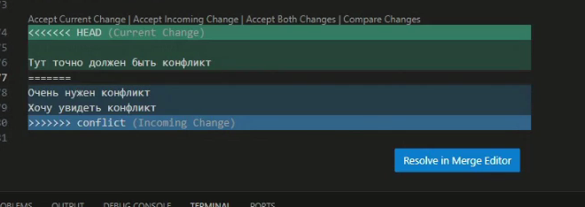
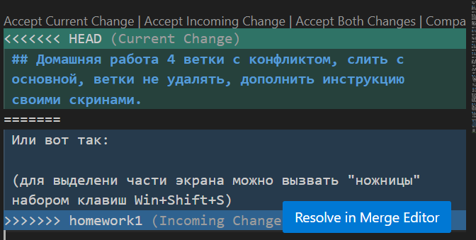

# Инструкция по Git

## 1. Проверка наличия установленного Git
В терминале вполняем команду 

*git --version*

 если Git установлен, то повится информаци о версии Git, иначе будет показана проблема.

## 2. Установка Git
Загружаем последнюю версию Git с сайта - <https://git-scm.com/>

## 3. Настройка Git
При первом использовании Git необходимо представиться:

*git config --global "user_name"*

*git config --global "user e-mail"*

Для того, чтоб проверить прошла ли регистрация нужно ввести команду:

*git config --list*

## 4. Инициализация репозитория
В папке выполняем команду 

*git init*

В исходной папке повится скрытая папка .git

## 5. Проверка текущего состония
Для проверки текущего состояния вызываем команду 

*git status*

Если имя файла красное - необходимо сохранить файл командой

 *git commit -a -m "Комментарий"*

## 6. Добавление файла в Git
Перед каждым сохранением необходимо добавлть файл в Git  коммандой

*git add "имя файла"*

для выбора имени файла можно воспользоваться клавишей "Tab" после пробела

## 7. Фиксирование текущей версии файла
Фиксирование текущей версии файла производится при помощи команды 

*git commit -m "Комментарий"*

после выполнения команды git add,
где после параметра "-m" обзательно указывается комментарий к текущему сохранению (желательно на английском языке)

Существует возможность исключить необходимость написания комманды *add*  перед командой *commit* если вызвать команду со следующими параметрами:

*git commit -a -m "Комментарий"*
 
## 8 Журнал изменений
Для вывода журнала изменений используется команда

*git log*

Для вывода журнала изменений в одну строку возможно выполнение команды с параметром 

*git log --oneline*

## 9 Проверка изменений
Проверка изменений текущего состония относительно последнего изменения выполнется коммандой

*git diff*

## 10 Переключение между версиями
Переключение между версиями производится коммандой 

*git checkout "номер коммита"*

где, параметру "номер коммита" присваевается значение первых четырех символов номера версии, который показывается вызовом комманды 

 *git log*

 Для перехода к текущей версии
необходимо набрать комманду 

 *git checkout master*

## 11 Добавление картинок и игнорирование файлов
 Дл того чтобы разместить картинку в нашем файле надо добавить ее в папку и после этого в нужном месте пишем следующее:
  

 Для того, чтоб удалить файл с изображениями из отслеживания нужно создать файл .gitignore

 ## 12 Ветвление
 Для создания новой ветки необходимо вполнить команду:
 git branch имя name_branch

Ветвление необходимо для работы с файлом в отдельной ветке, сохраняя при этом исходное состояние файла до их слияния. Чтобы отобразить созданные ветки используется команда git branch
Чтобы перейти на другую ветку используется команда git checkout branch_name

## 13 Слияние веток
Для слияния веток и внесения изменений в основной файл используется команда git merge branch_name
Слияние делается в ту ветку, в которой мы находимся сейчас.

## 14 Конфликты
 Конфликты возникают,при слинии двух веток в одну, при этом должна быть изменена одна и та же строка. 
 Конфликт выглядит вот так:
 

 Или вот так:
 

 (для выделени части экрана можно вызвать "ножницы" набором клавиш Win+Shift+S)

 Для разрешения конфликта можно:
* принять основнми изменения сделанные в текущей ветке (Accept Current Change);
* принять изменения сделанные во входящей ветке (Accept Incoming Change)
* Принять все изменения (Accept Both Changes)
* Сравнить изменения (Compare Changes)

## 15 Работа с удаленными репозиториями
 ### 15.1. Требования
 Для работ с удаленными репозиториями необходимо создать или открыть папку в которой **нет** локального репозитория.
 Предварительно нужно зарегистрировать аккаунт на удаленном репозитарии (например GitHub)
 ### 15.2. Перенос данных на свой аккаунт
 Используя ссылку зайти на необходимую страницу GitHub и с помощью кнопки "Folk" перенести данные на свой аккаунт.
 ## 15.3. Клонирование копии репозитария на локальный компьютер
 Для клонирования репозитария необходимо получить ссылку при помощи кнопки "Code", далее набрать команду: 

 *git clone "ссылка на репозитарий"*
 
## 15.4. Требование по работе на локальном компьютере
После переноса в выбранной папке повлется папка с копией репозитария. Для перехода в папку с данными можно в терминале написать команду

*cd "имя папки"*
  
  Можно перейти в папку, кликнув правой клавишей мыши на имя папки и выбрать "Open in Integrated Terminal"

