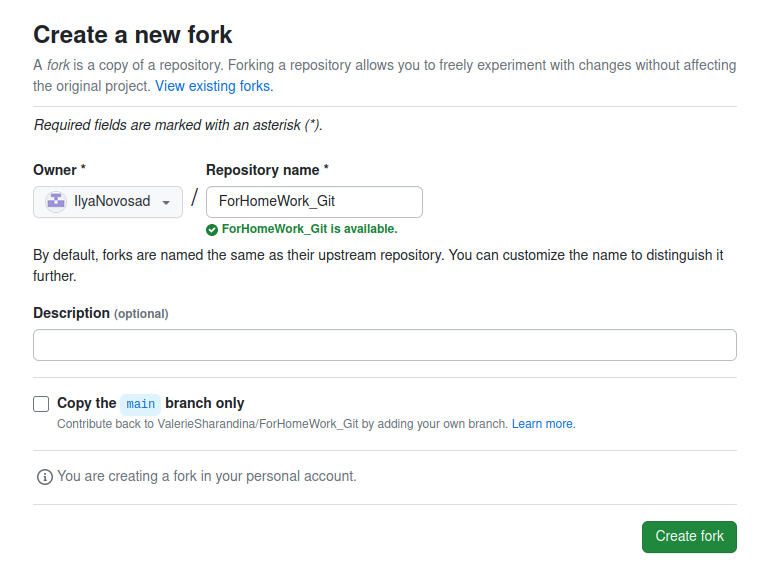
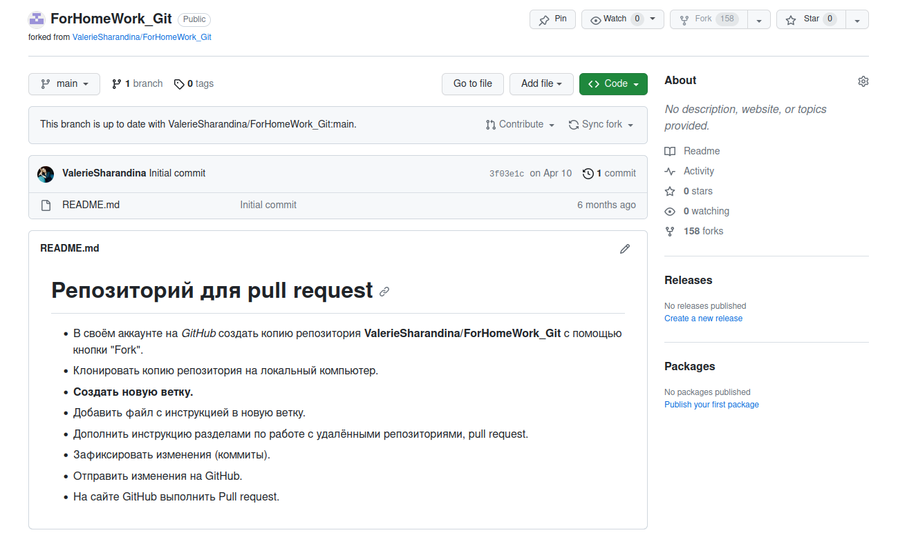
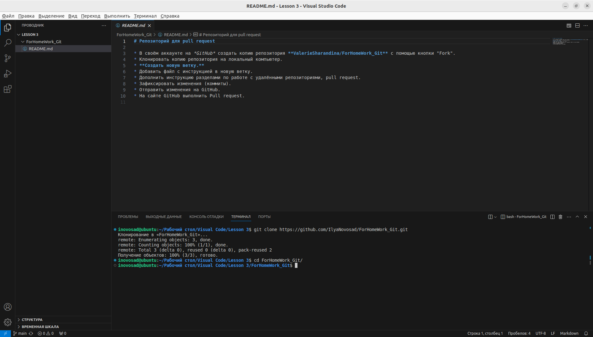
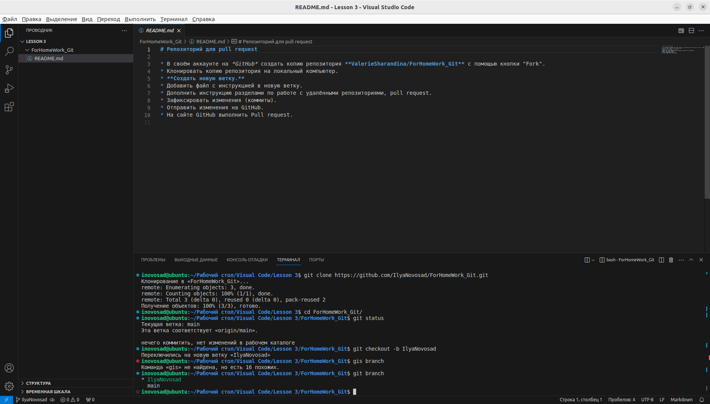

# Инструкция по работе с git
## 1. Проверка наличия установленного git
В терминале выполняем команду git version.
Если git установлен, то появится информация о версии файла, иначе будет сообщение об ошибке.

## 2. Установка git.
Загружаем последнюю версию с сайта https://github.com/git-for-windows/git/releases/download/v2.42.0.windows.2/Git-2.42.0.2-64-bit.exe для установки на *ОС* Windows. Для установки Git на *ОС* Ubuntu необходимо выполнить следующую команду:

    sudo apt-get update
    sudo apt-get git

Дальше нам необходимо выполнить проверку результата https://github.com/git-for-windows/git/releases/download/v2.42.0.windows.2/Git-2.42.0.2-64-bit.exeустановки, для этого в терминале нам необходимо выполнить команду:

    git version

Результатом выполнения данной команды описан в пункте 1.

## 3. Настройка git
При первом использовании git необходимо представиться, для этого нудно ввести две команды

    git config --global "user_name"
    git config --global "user_email"
Для того, чтобы проверить, прошла ли регистрация нужно ввести команду:

    git config --list
## 4. Инициализация репозитория
Для выполнения инициализации нового репозитория в git введите команду:

    git init
После выполнения данной команды в исходной папке появится скрытая папка с названием .git

## 5. Начало контроля версии файла
Для того, чтобы приступить к контролю версии файла (контроль изменений), необходимо выполнить следующую команду:

    git add file_name
    git add .
После выполнения данной команды рекомундуется проверить результат ее выполнения необходимо ввести команду

    git status

В результате в окне терминала будут выведены следующие строки:

    Текущая ветка: master

    Еще нет коммитов

    Изменения, которые будут включены в коммит:
      (используйте «git rm --cached <файл>...», чтобы убрать из индекса)
        новый файл:    file_name.md

## 6. Создание контрольных точек файла
Для создания контрольных точек файла и добавления к ним комментария необхлодимо в терминале выполнить команду 

    git commit -m "Description"

Результатом выполнения данной команды будет вывод в терпинале сообщения 

    [master 4960704] Добавлен раздел *
     1 file changed, 19 insertions(+), 2 deletions(-)

Для ускорения создания контрольных точек и упрощения контроля версий файлов, рекомендуется выполнять приведенную выше команду с ключами:

    git commit -am "Description"

В результате выполнения данной команды будут добавлены актульаные изменения, а также создана контрольная точка с приведенным комментарием.

## 7. Проверка списка контрольных точек
Для выполнения проверки списка, созданных ранее, контрольных точек рекомендуется использовать команду:

    git log

В результате выполнения данной команды в строках терминала будет отображен список созданных ранее контрольных точек с комментариями:

    commit 4960704403edf4c148003197ef20fddd9cad7a71 (HEAD -> master)
    Author: user_name <mail@email.com>
    Date:   Wed Sep 27 10:27:00 2023 +0300

    Description

Стоит обратить внимание, что приведенная информация является полной, но в некоторых случаях избылочной, для сокращения списка отображаемой информации рекомендовано выполнять приведенную команду с ключем oneline:

    git log --oneline

В результате мы получим сокращенную версию списка контрольных точек и комментариев к ним:

    4960704 (HEAD -> master) Добавлен раздел 5
    bd04907 Заполнен раздел 2
    aa74751 Добавили раздел 4
    d4868f7 Внесли раздел 3
    bb5eec1 Добавили раздел 2
    81d3c74 Заполнили раздел 1

## 8. Переключенние между контрольными точками
Для того, чтобы выполнить переключения между сохраннеми ранее контрольными точками рекомендуется использовать команду:

    git checkout commit_name

В результате откроется файл с актуальным, на момент создания контрольной точки, содержимым.

## 9. Определение различий содержимого текущего файла и последней контрольной точки
Для определения данных различий необходимо использовать команду:

    git diff

в данном случае в терминале отобразится информация о внесенных, но не добавленных в контрольную точку, изменениях файла:

    diff --git a/git instruction.md b/git instruction.md
    index 0604aec..cfc0e30 100644
    --- a/git instruction.md        
    +++ b/git instruction.md        
    @@ -97,4 +97,11 @@
 
     В результате откроется файл с актуальным, на момент создания контрольной точки, содержимым.
 
    +## 9. Определение различий содержимого текущего файла и последней контрольной точки
    +Для определения данных различий необходимо использовать команду:
    +
    +    git diff
    +
    +в данном случае в терминале отобразится информация о внесенных, но не добавленных в контрольную точку, изменениях файла:
    +

В случаае, если контрольная точка была созадана, результатом выполнения вышеуказанной команды будет:

    строка терминала для введения новой команды:
    user_name@ubuntu:~/Рабочий стол/Visual Code/Git$ 
    
## 10.Добавление картинок и игнорирование файлов

Для того, чтобы разместить картинку в нашем фале необходимо добать картинку в папку и после этого в нужном месте пишем следующее:

    

Для того, чтобы удалить файлы изображений из отслеживания нужно создать файл .gitignore и внести в него строки с необходимыми для исключения картинок расширениями.

## 11. Ветвление

Для создания новой ветки необходимо ввести в терминале команду:

    git branch new_branch_name

Ветвление необходимо для работы с файлами в отдельной ветке, сохраняя при этом исходное состояние файла до слияния веток. Чтобы отобразить созданные ветки используется команда:

    git branch

Чтобы перейти на другую ветку используется команда:

    git checkout branch_name

## 12. Слияние веток

Для слияния веток и внесения изменения в основной файл (находится в ветке master) использкется комнда:

    git merge branch_name

## 13. Конфликты

Хочу увидеть конфликт!

Конфликты возникают при слиянии двух веток в одну, при этом должна быть изменена одн и таже строка файла. В данном случае мы приняли входищие изменения из ветки конфликт.

Давайте рассмотрим альтернативный вариант, когда нам необходимо сохранить строки из ветки master и ветки homework так как данные из обоих веток уникальны и важны. Ниже приведен скриншот возникающих разногласий:

Для сохранения строк из обоих веток, нам нужно нажать "Принять оба изменения".

Конфликты возникают при слиянии двух веток в одну, при этом должна быть изменена одна и таже строка файла.

## 14. Клонированние внешного репозитория

Перед клонированием внешнего репозитория, локальный репозиторий не должен быть инициализирован в папке с текущим проектом.Если же папка иницализирована (создан локальный репозиторий), необходимо удалить скрытуу папку **.git**

Для копирования используется команда:

    git clone

пример выполнения git clone

Команда не только загружает все изменения, но и пытается слить все ветки на локальном компьютере и в удаленном репозитории.
## 15. Переход в клонированную папку

Для продолжения работы в клонированном репозитории, необходимо перейти в эту папку. Для этого используется команда:

    cd folder_name

Или достаточно найти ее в списке папок и после нажатия правой кнопкой "Открыть во встроенном терминале", данный вариант наиболее приемлем для крупных проектов, где искать имя для введения команды через терминал достаточно трудозатратно.

## 16. Отправка своей версии репозитория в удаленный репозиторий

Для этого необходимо использовать команду:

    git push

пример выполнения git push:

При первом использовании команды необходимо сделать авторизацию.
## 17. Загрузка из удаленного репозитория в локальный

Для этого необходимо использовать команду:

    git pull

пример выполнения git pull

Команда автоматически выполнит merge с нашей веткой
## 18. Участие в проекте GitHub

Для того, чтобы участвовать в чужом проекте и предлагать свои изменения, необходимо:

    1. Сделать fork (ответление) репозитория, при создании ответвления нам обязательно нужно убирать галочку "Copy the main branch only". Это позволит нам создать полноценное ответвление, включающее в себя все ветки проекта!

В результате успешного создания ответвления проекта в своем аккаунте мы увидим:

    2. Сделать git clone своей версии репозитория

    В результате выполнения данной команды, удаленный репозиторий будет выгружен в указанную папку (полное копирование репозитория, получеенного в пункте 1 раздела 18)

    3. Создать новую ветку и в нее вносить свои изменения (внесение изменений в ветке main или master является не только дурным тоном, при совместной раборте над проектом, но и грубой ошибкой!!!)

    Сделать коммиты
    Отправить свою версию на GitHub
    На сайте GitHub нажать кнопку pull request

