# <center>**Инструкция по Git**</center>
## 1. Установка и настройка Git
### Установка Git
* Заходим на официальный сайт **Git** (https://git-scm.com/downloads)
* Выбираем свою операционную систему с учетом разрядности и скачиваем файл установки. В нашем случае это будет **Windows x64**

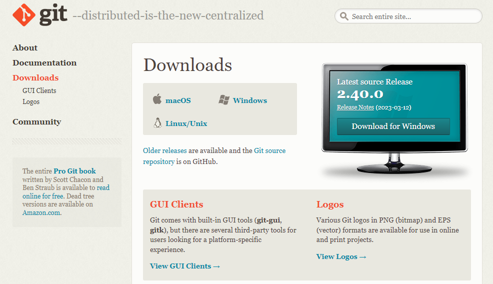

* Запускаем файл установки **Git** и нажимаем **Next**

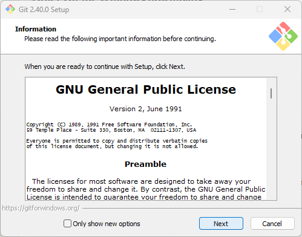

* Отмечаем (опционально) галочкой **On the Desktop**, что добавит нам ярлык на рабочий стол и снова нажимаем **Next**

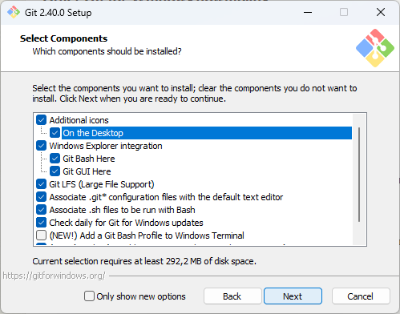

* Выбираем любой удобный для Вас редактор и снова нажимаем **Next**

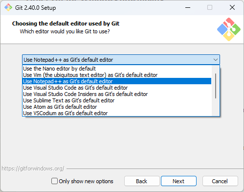

* Далее жмем **Next** оставляя все опции по умолчанию пока не начнется установка **Git** 

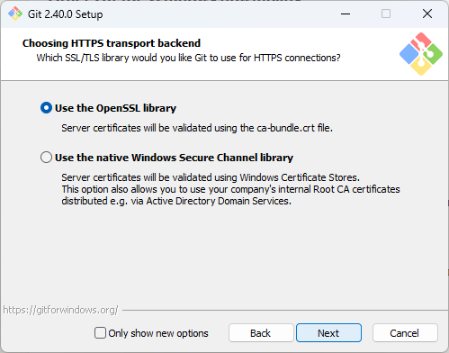

* После установки жмем **Finish**

### Настройка Git
* Запускаем **терминал** или кликаем по ярлыку **Git Bash** на рабочем столе проверяем установку **Git** командой:
```
git --version
```
* При правильной установке получаем ответ (цифры версий могут отличаться):
```
git version 2.40.0.windows.1
```
* Далее нам нужно задать *имя* и *электронную почту*, которыми будут подписываться наши коммиты:
```
git config --global user.name "Ваше имя"
git config --global user.email "Ваша электронная почта"
```
### На этом установка и настройка Git закочены
<br>

## 2. Инициализация репозитория
* На компьютере, желательно в корне диска, создаем новую папку **"repo"**: 

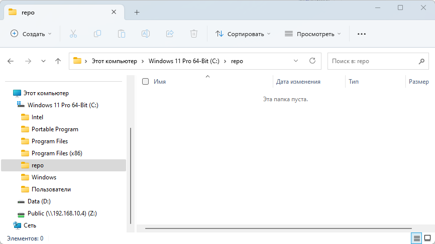

* Переходим в нее в терминале: 
```
cd c:\repo
```

* Либо если используем **Visual Studio Code** - *Файл - Открыть папку...* и указываем на созданную нами папку **repo** и соглашаемся с доверительными условиями:

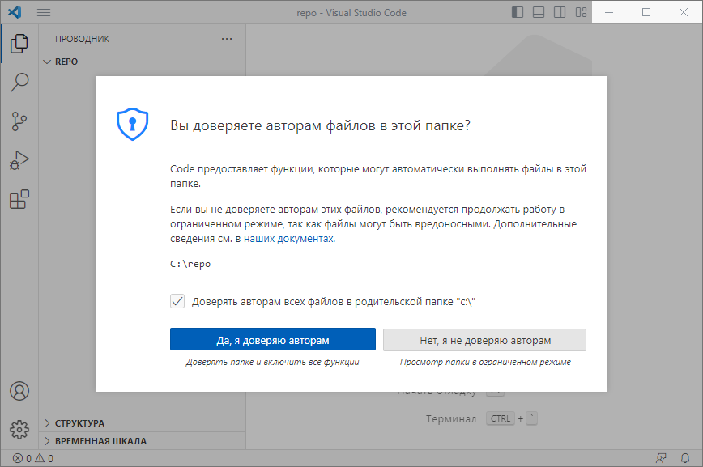

и открываем встроенный в программу терминал нажатием на *Ctrl + ~*

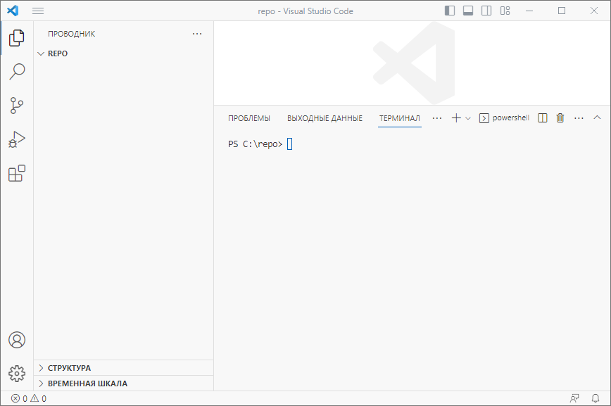

* Для инициализации репозитория набираем команду:
```
git init
```
получаем ответ 
```
Initialized empty Git repository in C:/repo/.git/
```
* Проверяем командой:
```
ls -h
```
получем ответ
```
Каталог: C:\repo


Mode                 LastWriteTime         Length Name
----                 -------------         ------ ----
d--h--        06.04.2023     18:42                .git
```
видим что появилась скрытая папка **.git** и тем самым проверяем что инициализация репозитория прошла успешно!
<br>

## 3. Запись изменений в репозиторий
* Для начала проверим статус репозитория командой:
```
git status
```
получаем ответ 
```
On branch master

No commits yet

nothing to commit (create/copy files and use "git add" to track)
```
это означает что мы находимся в ветке **master**, у нас нет коммитов и нам нечего коммитить, так как нет никаких файлов
* Создадим файл READMI.md командой: 
```
echo 'Домашняя работа' > READMI.md
```
* Либо если работаем в Visual Studio Code нажимаем на иконку создать файл и создаем **READMI.md**:

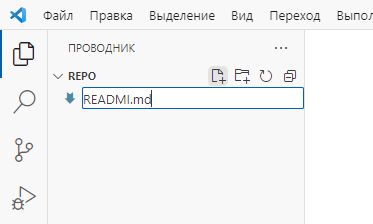

и добавляем в него текст во вкладке справа

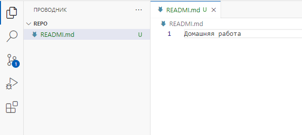

и сохраняем изменения в файле сочетанием *Ctrl + S*
* Далее сохраним наши изменения в репозиторий через терминал, для начала наберем:
```
git status
```
и увидим
```
On branch master

No commits yet

Untracked files:
  (use "git add <file>..." to include in what will be committed)
        READMI.md

nothing added to commit but untracked files present (use "git add" to track)
```
что  говорит нам что мы находимся в ветке **master**, у нас есть неотслеживаемый файл и поэтому нам не добавить коммит
* Добавляем файл в репозиторий:
```
git add .\READMI.md
```
* И создаем коммит
```
git commit -m 'добавили файл READMI'
```
и получаем ответ что запись измений в репозиторий произведена
```
[master (root-commit) a13bda6] add file README
 1 file changed, 1 insertion(+)
 create mode 100644 READMI.md
 
 On branch master
nothing to commit, working tree clean
```
<br>

## 4. Получение информации по истории коммитов
* Допустим мы внесли множество изменений и файлов в репозитории и соответственно добавляли коммиты. Для того чтобы просмотреть историю коммитов, вводим:
 ```
git log
```
получаем ответ
```
commit d33e15fc7d2976a931d7297d247d375c9caa2186 (HEAD)
Author: KU3MI4 <kuzmichov@bk.ru>
Date:   Thu Apr 6 19:37:30 2023 +0300

    temp commit for repo foler switch

commit cdf635cb8916509e38e6c56b3031ef2a9e193f47
Author: KU3MI4 <kuzmichov@bk.ru>
Date:   Thu Apr 6 19:20:04 2023 +0300

    add initialization instruction

commit d7f9169087a8333efe41a5647879edaaeabe4f7f
Author: KU3MI4 <kuzmichov@bk.ru>
Date:   Thu Apr 6 18:33:06 2023 +0300

    temp commit for new repo

commit 393ea5bca8fe0a09ee73fd2659a0c243fcdceac4
Author: KU3MI4 <kuzmichov@bk.ru>
```
где будет видно кто, когда и какие коммиты оставлял
* Есть более короткая версия вывода коммитов:
```
git log --oneline
```
получаем
```
d33e15f (HEAD) temp commit for repo foler switch
cdf635c add initialization instruction
d7f9169 temp commit for new repo
393ea5b add a git setting
a6633d0 added a mention of the operating system
3f60246 add install git instruction and picturies
cd64d95 add pic git site
f55d96c dowloading git setup file
7acd078 center header
199fef8 add pic
150bdb2 write second part
af9804b add second part
5613e87 write first part
3f22a3e add first part in instruction
f37d0a5 initial commit
```
команда удобна когда у нас много коммитов.

* Так же можно вывести лог в виде *"дерева"* если в нашем проекте существуют ветки 
```
git log --graph
```

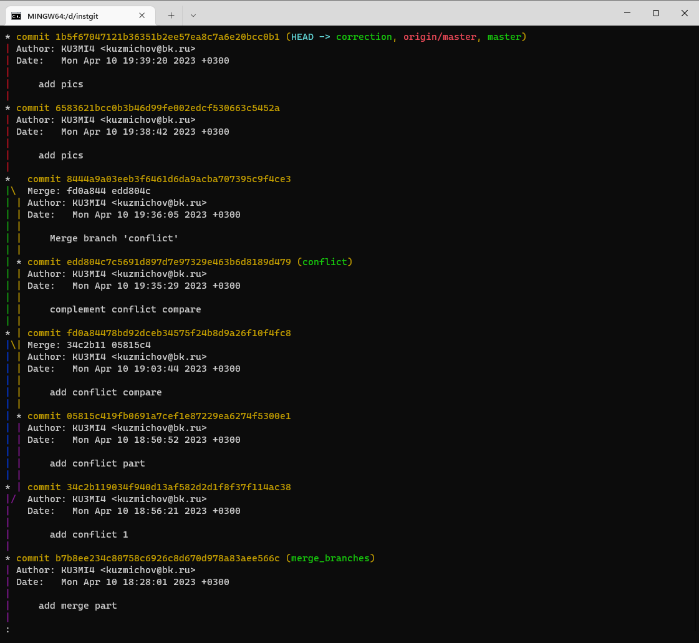

А так же короткая версия:

```
git log --oneline --graph
```

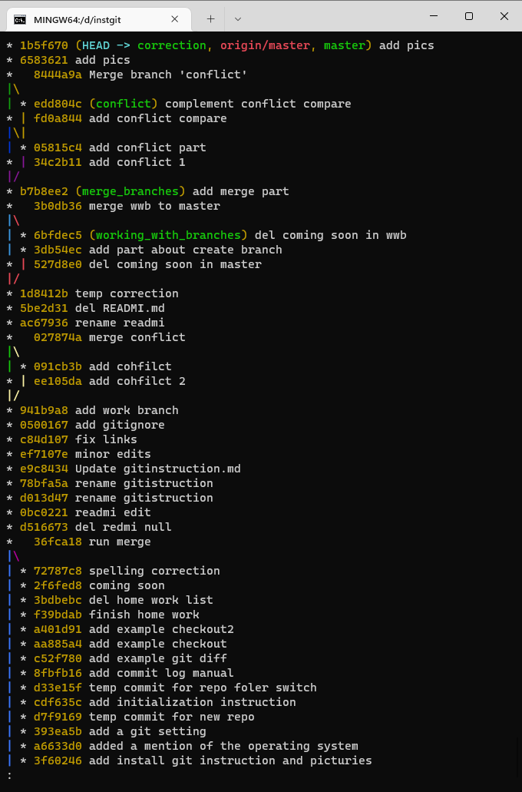

<br>

## 5. Сравнение изменений с последним коммитом
* Для вывода изменений в файлах по сравнению с последним коммитом, используется команда **git diff**:
```
git diff
```
получаем ответ
```
diff --git a/gitinsruction.md b/gitinsruction.md
index 674e2dd..47dad74 100644
--- a/gitinsruction.md
+++ b/gitinsruction.md
@@ -178,6 +178,10 @@ Author: KU3MI4 <kuzmichov@bk.ru>
 где будет видно кто, когда и какие коммиты оставлял
 * Есть более короткая версия вывода коммитов:
+git log --oneline
+```
+получаем
+```
 d33e15f (HEAD) temp commit for repo foler switch
 cdf635c add initialization instruction
 d7f9169 temp commit for new repo
@@ -195,6 +199,19 @@ af9804b add second part
 f37d0a5 initial commit
 команда удобна когда у нас много коммитов.
+<br>
+
+## 3. Сравнение изменений с последним коммитом
+* Для вывода изменений в файлах по сравнению с последним коммитом, используется команда **git diff**:
+```
+git diff
+```
+получаем ответ
```
* Тут мы видим изменения в файлах, которые еще не были добавлены в индекс репозитория
<br>

## 6. Перемещение между сохранениями
* Для перемещения между сохранениями нам потребуется сохранить все изменения и вызвать лог:
```
git log --oneline
```
выводится наш лог с индексами сохранений
```
c52f780 (HEAD) add example git diff
8fbfb16 add commit log manual
d33e15f temp commit for repo foler switch
cdf635c add initialization instruction
d7f9169 temp commit for new repo
393ea5b add a git setting
a6633d0 added a mention of the operating system
3f60246 add install git instruction and picturies
cd64d95 add pic git site
f55d96c dowloading git setup file
7acd078 center header
199fef8 add pic
150bdb2 write second part
af9804b add second part
5613e87 write first part
3f22a3e add first part in instruction
f37d0a5 initial commit
```
* Для того чтобы нам переместиться на нужное сохранение, нужно скопировать его индекс и воспользоваться командой **checkout**:
```
git checkout af9804b
```
например к этому сохранению
* Для того чтобы вернуться обратно к последнему сохранению вводим:
```
git checkout master
```
<br>

## 7. Создание веток, перемещение между ветками и их удаление в репозитории
* Для создание новой ветки в репозитории, необходимо выполнить команду:
```
git branch имя_новой_ветки
```
например
```
git branch working_with_branches
```
* Для того чтобы вывести список имеющихся у нас веток выполним:
```
git branch
```
получаем вывод нашего списка
```
* master
  working_with_branches
  merge_branches
  conflict
  correction
```
(*) звездочка напротив названия ветки указывает в какой ветке мы находимся на данный момент
* Чтобы переместиться в нужную нам ветку, выполняем:
```
git checkout имя_ветки 
```
например
```
git checkout correction 
```
если все выполнено корректно, сохранено и сделан коммит перед переходом на другую ветку, мы получем ответ
```
Switched to branch 'correction'
```
* Для удаления ветки вводим команду:
```
git branch -d имя_ветки
```
например
```
git branch -d working_with_branches
```
получаем ответ
```
Deleted branch working_with_branches (was хххххх)
```
Ветка удалена
<br>

## 8. Слияние веток
* Например мы создали новую ветку, поработали с ней и теперь настала необходимость добавить это в **master** ветку, для этого сохраняем все в новой ветке, оставляем коммит и переходим в ветку **master** и выполняем слияние:
```
git merge имя_сливаемой_ветки
```
например
```
git merge working_with_branches
```
в случае если все хорошо, терминал ответит
```
Updating 0500167..941b9a8
Fast-forward
 gitinstruction.md | 8 ++++++++
 1 file changed, 8 insertions(+)
```
но бывают конфликтные ситуации, например в сливаемых ветках на одной и тойже строке у нас разные данные и Git непонимает какие данные нужнее и выдаст например:
```
Auto-merging gitinstruction.md
CONFLICT (content): Merge conflict in gitinstruction.md
Automatic merge failed; fix conflicts and then commit the result.
```
Это как раз и есть конфликт, который мы рассмотрим в следующем пункте инструкции...
<br>

## 9. Конфликт при слиянии веток
* Возьмем пример когда мы создали новую ветку, чтобы добавить новый код или кокой-нибудь текст и хотим слить эту ветку с главной, но при этом в ветке **master** в этих же строках находится иное от нашего и при попытке слияния мы получаем информацию о конфлике:

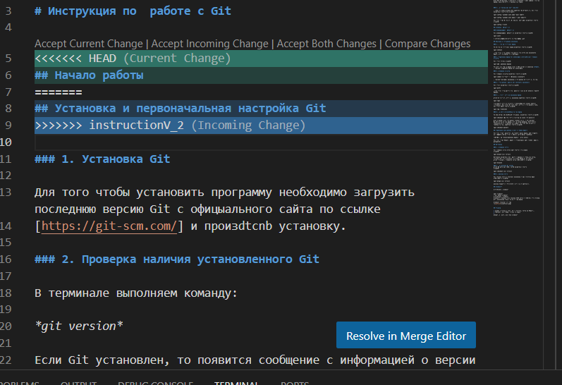

***Обратите внимание на верхнюю часть сообщения о конфликте, где находятся пунты, которые мы можем выбрать в соответствии с нашими потребностями:***

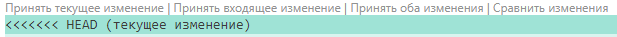

1. Мы можем **Принять текущее изменение**

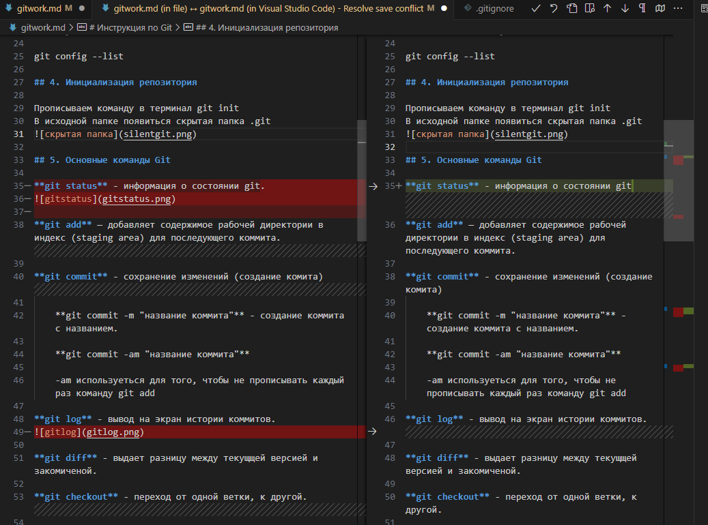

2. Мы можем **Принять входящее изменение**

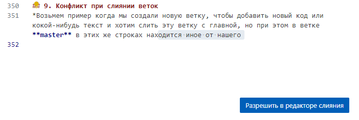

3. Мы можем **Принять оба изменения**

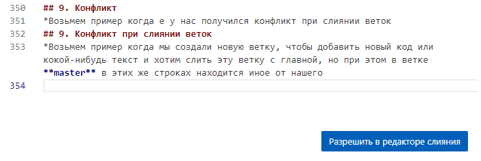

4. Мы можем **Сравнить изменения**

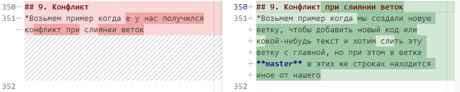

Таким образом мы слили обе ветки и оставили только тот код который нам нужен и избавились от конфликта при их слиянии.

.............................................................................

