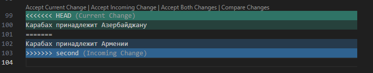

# **Инструкция по Git** 

### 1. Проверка наличия установленного Git

В терминале выполняем команду git version.
Если Git установлен, то появится сообщение с информацией о версии файла.
Иначе будет сообщение об ошибке.

### 2. Установка Git

Загружаем последнюю версию с сайта - 

### 3. Настройка GIt

При первом использовании Git необходимо представиться, для этого надо ввести две команды.

git config --global user.name
git config --global user.email

Для того чтобы проверить прошла ли регистрация надо ввести команду: git config --list

### 4. Инициализация Репозитория

Прописываем команду в терминал git init 

<body> В исходной папке появится скрытая папка .git </body>

## **Создание коммитов**

### Git add

Для добавления изменений в коммит используется команда *git add*. Чтобы использоваться команду *git add* напишите *git add <имя файла>*

### Просмотр состояния репозитория

Для того, чтобы посмотреть состояние репозитория используется команда *git status*. Для этого необходимо в папке с репозиторием написать *git status*,
 и Вы увидете были ли изменения в файлах, или их не было.

 ### Создание коммитов

 Для того, чтобы создать коммит (сохранение) необходимо выполнить команду *git commit*.
 Выполняется она так: *git commit -m <имя коммита>*

### Git diff

Команда *git diff* выводит изменения между вашей текущей рабочей директорией и стейлдингом.

### Git log

Разнообразная информация о коммитах в целом, по отдельным файлам и различной глубины погружения в историю.
Иногда требуется получить информацию об истории коммитов, коммитах, изменивших
отдельный файл. Для этого необходимо выполнить команду *git log*.

### Git checkout

В Git под термином checkout подразумевают переключение между различными версиями целевого объекта. Команда git checkout работает с тремя различными объектами: файлами, коммитами и ветками. Под переключением также обычно понимают действие, связанное с выполнением команды *git checkout*

# **Добавление картинок и игнорирование файла**

Для того чтобы разместить картинку в нашем файле надо добавить ее в папку и после этого в нужном месте пишем следующее:

Для того чтобы удалить файлы с изображением из отслеживания нало создать файл  *.gitignore*.

# **Ветвление**

Для создания новой ветки нужно прописать в терминале команду *git branch <имя ветки>*

Ветвление необходимо для работы сфайлами в отдельной ветке, сохраняя при этом исходное состояние файла до тех их слияния.

Чтобы отобразить созданные ветки, используйте команду git branch.

Чтобы перейти на другую ветку используем команду git checkout name_branch.

## Слияние веток

Для слияния веток и внесения изменений в наш основной файл используется команда *git merge <имя ветки>* 

Слияние делается в ту ветку в которой мы находимся сейчас.

## **Конфликты**

ХОЧУ МЯСА

Конфликты возникают при слиянии 2 веток в одну, при этом должна быть изменена одна и та же строка файла.

Конфликт выглядит вот так:

 
 ## **Конфликтуем первый раз**

 ***Сколько морей в Беларусии***
 

## **Конфликтуем второй раз**

Карабах принадлежит Азербайджану

Карабах принадлежит Армении

## **Конфликтуем третий раз**

Крым пренадлежит людям!

## **Четвертый конфликт**

Mur
Мур

# Удаление веток

**Для удаления ветки нужно прописать команду git branch -d 'название ветки'**

* Дополнить инструкцию разделами по работе с удалёнными репозиториями, pull request.
* Зафиксировать изменения (коммиты).
* Отправить изменения на GitHub.
* На сайте GitHub выполнить Pull request.

# Команда git clone

Для того чтобы скопировать удаленный репозиторий нужно ввести в терминале git clone <ссылка на удаленный репозиторий>.

# Команда git pull

Для получения изменений из переданного удаленного репозитория и обновления рабочей копии в соответствии с удаленным репозиторием вам потребуется ввести в терминал команду git pull

# Команда git push

Для отправки изменений в удаленный репозиторий нам потребуется прописать команду git push.

