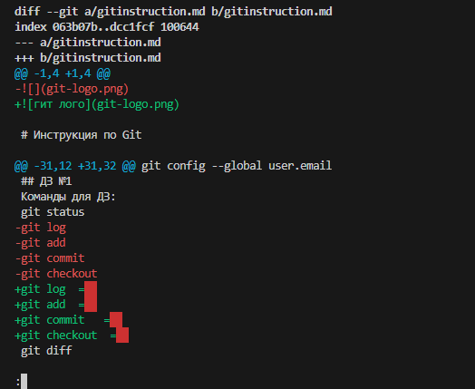

# Инструкция по Git 

## 1. Проверка наличия установленного Git

В терминале выполняем команду **git version**.
Если Git Установлен, то появится сообщение с информацией о версии файла.
Иначе будет сообщение об ошибке.

## 2. Установка Git

Загружаем последнюю версию Git с этого [сайта](https://git-scm.com/)

## 3. Настройка Git

При первом использовании Git необходимо представиться, для этого на ввести 2 команды.

**git config** --global user.name

**git config** --global user.email

Для того чтобы проверить прошла ли регистрация надо ввести комманду: git config --list

## 4. Инициализация Репозитория

Прописоваем в терминал команду **git init**

В исходной папке появится файл **.git**

## 5. Работа с коммитами

Для создания коммита надо указать git файл для отслеживания, это можно сделать с помощью команды **git add** <имя_файла>.

После добавления файла можно сделать commit с помощью команды **git commit -m** "комментарий"

После того как вы создали commit, его можно увидеть с описанием череp команду **git log**:

Для перехода между коммитами используется команда **git checkout** <номер коммита>.  

Для перехода не обязательно вводить полный монер, достаточно ввести первые 4 символа:  

  

Для перехода обратно на главную ветку используется команда **git checkout master**

Для просмотра изменений между коммитами можно использовать команду **git diff**:

Команда **git status** показывает состояние отслеживаемого файла:

## 6. Добавление картинок и игнорирование файлов
Для того чтобы разместить картинку в нашем файле надо добавить ее в папку и после этого в нужнов месте пишем следушее:

Для того чтобы удалить файлы с  изображениями после отслеживания надо создать файл **.gitignore**

## 7. Ветвление 
Для создания новой ветки надо ввести в терминале команду **git branch** branch_name

Ветвление необходимо для работы с файлами в отдельной ветке, сохраняя при этом исходное состояние файла до их слияния.

Чтобы отоброзить созданные ветки, исполоьзуется команда **git branch**

Чтобы перейти на другую ветку используем команду **git checkout** branch_name

## 8. Слияние веток

Для слияния веток и внесения изменений в наш основной файл, используется команда **git merge** branch_name влияное делается в ту ветку, в которой мы находимся сейчас

## 9. Конфликты

Конфликт

Тут точно должен быть конфликт
Очень нужен конфликт
Хочу увидеть конфликт

Конфликты возникают при слиянии 2х веток в 1 при этом должна быть изменена 1 и таже строка файла

Конфликт выглядит вот так:

## 10. Работа с удалёнными репозиториями

**git clone**  
Эта команда позволяет скопировать удаленный репозиторий на ваш ПК. Для ее выполнения вам будет нужна ссылка на удаленный репозиторий.

Поле выполнения команды в выбранной вами папке появится копия репозитория.
К тому же, по умолчанию команда **git clone** автоматически настраивает вашу локальную ветку **master** на отслеживание удалённой ветки **master** на сервере, с которого вы клонировали репозиторий.

**git pull**  
Эта команда позволяет скачать все из текущего репозитория и автоматически сделать merge с нашей версией.

**git push**  
Эта команда позволяет отправить нашу версию репозитория на внешний репозиторий. При первом её использовании нужна авторизация.

## 11. Pull request 

1. Делаем fork репозитория  

2. Делаем git clone своей версии репозитория 

3. Создаем новую ветку и в нее вносим изменения

4. Делаем коммиты

5. Отправляем свою версию в GitHub (**git push**)

6. На сайте GitHub нажимаем кнопку pull request

