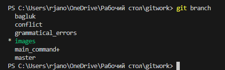

# Инструкция по Git

## 1. Проверка наличия установленного Git

В терминале выполняем команду git version.
Если Git установлен появиться сообщение с информацией о версии файла.
Иначе будет сообщение об ошибке.

## 2. Установка Git

 Если у вас уже установлен Git, вы можете получить последнююверсию разработки через Git:

 git clone https://github.com/git/git

## 3. Настройка Git

При первом использовании Git необходимо представиться, для этого надо ввести 2 команды.

git config --global user.name
git config --global eser.email

Для того чтобы проверить прошла ли регистрация, надо ввести команду:

git config --list

## 4. Инициализация репозитория

Прописываем команду в терминал git init
В исходной папке появиться скрытая папка .git

## 5. Основные команды Git

**git status** - информация о состоянии git.

**git add** — добавляет содержимое рабочей директории в индекс (staging area) для последующего коммита.

**git commit** - сохранение изменений (создание комита)

    **git commit -m "название коммита"** - создание коммита с названием.

    **git commit -am "название коммита"** 

    -am используеться для того, чтобы не прописывать каждый раз команду git add

**git log** - вывод на экран истории коммитов.

**git diff** - выдает разницу между текущщей версией и закомиченой.

**git checkout** - переход от одной ветки, к другой.

## 6. Добавление картинок и игнорирование файлов

Для того чтобы появилась картинка, нужно добавить её в папку, и в нужном месте написать

Для того чтобы удалить файлы из отслеживания, нужно создать папку 
.gitignore

## 7.Ветвление

Для создания новой ветки необходимо ввести команду git branch НАЗВАНИЕ

Ветсвление необходимо для работы с файлами в отдельной ветке сохраняя при этом иходное состояние файла до слияния.

Чтобы отобразить созданные ветки и узнать в какой ветке вы сейчас находитесь, используется команда git branch

Чтобы перейти в другую ветку, используем команду git checkout name_branch

## 8.Слияние веток

Для слияния веток и внесения изменений в основной файл, используеться коанда git merge NAME

Слияние делается в ту ветку, в которой мы находимся сейчас

## 9. Конфликты

Конфликты возникают при слиянии двух веток в одну, при этом должна быть изменена одна и таже строка файла.

Конфликт выглядит так

## 10. Работа с удаленным репозиторием

Для начала работы с чужим репозиторием, необходимо "подписаться" на него в Github, для этого необходимо нажать на кнопку FORK

Далее необходимо перейти в свой профиль на Git и найти ссылку

Для того, чтобы открыть репозиторий в VScode необходимо ввести команду 

**git clone ссылка на репозиторий**

После изменений файла для загрузки его на Git необходимо ввести команду 

**git push origin** 

в терминале выдаст подсказку о том, как ввести полную команду 

Для того, чтобы отправить изменения в основной репозиторий (с которого был сделан клон), необходимо на Git найти наш измененный репозиторий и нажать кнопку 

**Compare & pull request**

после чего хозяин основного репозитория может добавить ваши изменения