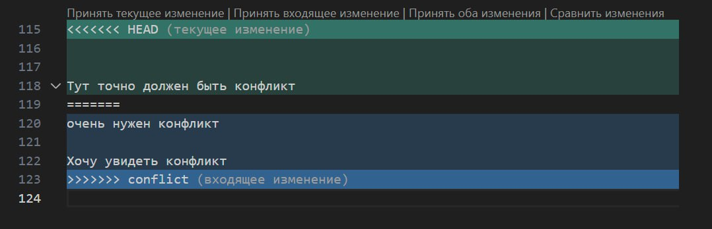
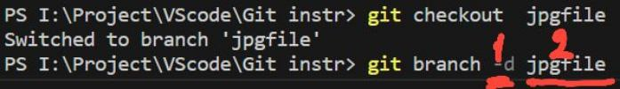
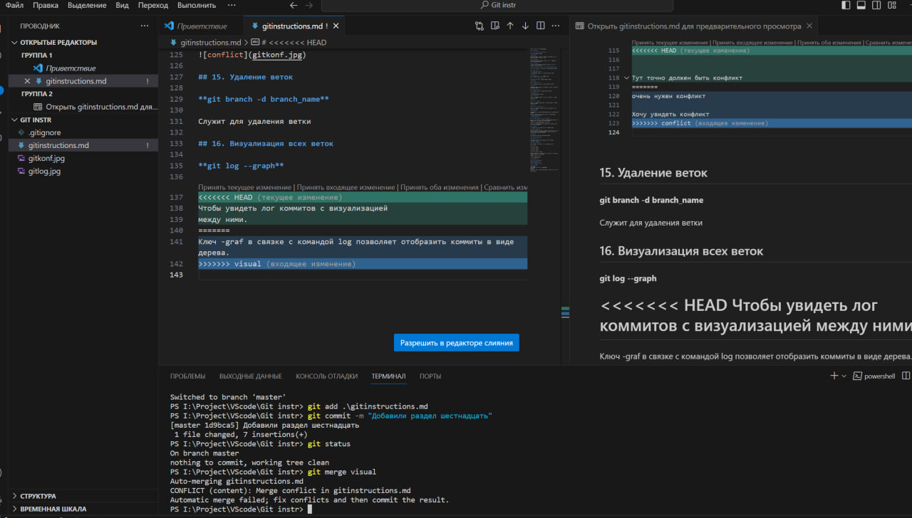

# Инстуркция по git

## 1. Проверка наличия установленного git

В терминале выполняем команду 

**git version**

Если git установлен, то появится сообщение с информацией о версии файла, иначе будет сообщение об ошибке.

## 2. Установка git

Для установки необходимо загрузить последнюю версию с официального сайта - https://git-scm.com 

## 3. Настройка git  

При первом использовании git, необходимо представиться, для этого необходимо ввести две команды: 

**git config --global user.name и git config --global user.email**

Для того, чтобы проверить регистрацию в терминале выполняем команду: 

**git config --list**

## 4. Инициализация репозитория

Для инициализации репозитория в терминале выполняем команду: 

**git init**

В исходной папке появится скрытая папка *".git"*

## 5. Проверка состояния репозитория

Для проверки состояния в терминале выполняем команду: 

**git status**

## 6. Добавление коммитов  

Для того добавления коммита, в терминале выполняем команду:

**git add**

И указываем название файла, который необходимо сохранить. Для удобства использовать "Tab"

## 7. Сохранение коммитов

Для сохранения коммита, в терминале выполняем команду:

**git commit -m " "**
 
 В кавычках указываем комментарий 

 ## 8. Журнал версий

Для того, чтобы узнать какие версии коммитов сохранены, в терминале выполняем команду:

**git log**

## 9. Просмотр изменений

Для просмотра разницы между текущим и сохраненным файлом,в терминале выполняем команду:

**git diff**

## 10. Переключение между версиями

Для того, чтобы перейти к нужной версии коммита, необходимо ввести команду в терминал: 

**git checkout**

И указываем первых 4 символа из наименования нужного коммита/его полное название.

Для того, чтобы продолжить работу и вернуться к рабочему файлу, в терминале выполняем команду:

**git checkout master**

## 11. Добавление картинок и игнорирование файлов

Для того, чтобы разместить картинку в нашем файйле, нужно добавить её в папку и после этого в нужном месте, пишем следующее: 

Для того, чтобы удалить файлы с изображениями из отслеживания, нужно создать файл " .gitignore "

## 12. Ветвление

Для создания новой ветки, нужно ввести в терминале команду: 

**git branch name_branch**

Ветвление, необходимо для работы с файлами в отдельной ветке, сохраняя при этом исходное состояние файла до их слияния. Чтобы отобразить созданные ветки, используется команда: 

**git branch**

Чтобы перейти на другую ветку, используем команду: 

**git checkout name_branche**

## 13. Слияние веток

Для слияния веток и внесения изменений в наш основной файл, используется команда: 

**git merge name_branch**

Слияние делается в ту ветку, в которой мы находимся сейчас.

## 14. Конфликты

Хочу увидеть конфликт

Очень нужно конфликт

Хочу увидеть конфликт

Тут точно должен быть конфликт

Конфликты возникают при слиянии двух веток в одну, при этом должна быть изменена одна и та же строка файле. 

Конфликт выглядит вот так:

## 15. Удаление веток

**git branch -d branch_name**

Служит для удаления ветки

## 16. Визуализация всех веток

**git log --graph**

Чтобы увидеть лог коммитов с визуализацией
между ними.
Ключ -graf в связке с командой log позволяет отобразить коммиты в виде дерева.

**Пример моего нофликта**

