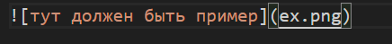
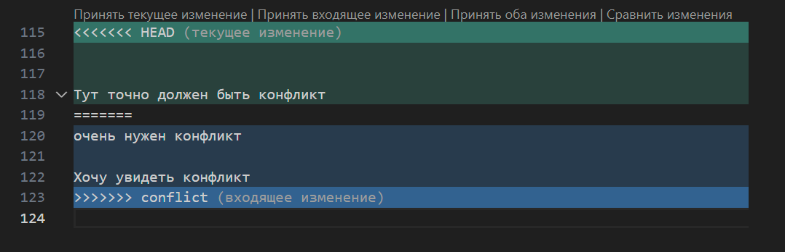
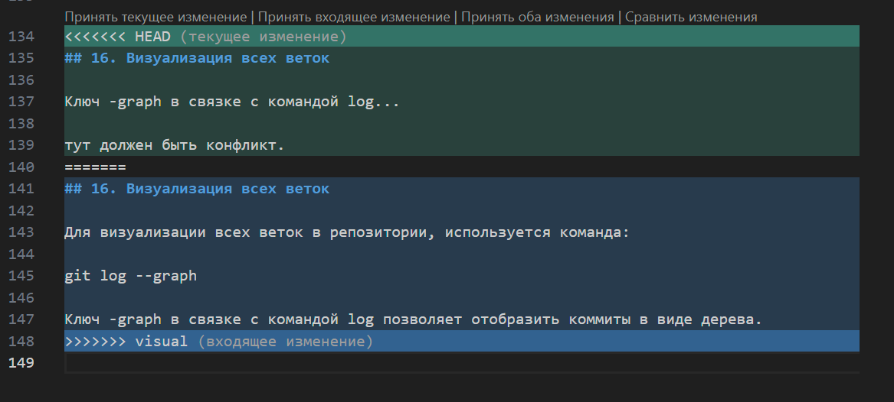
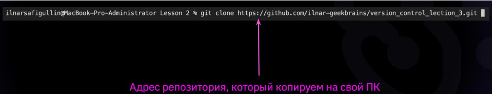
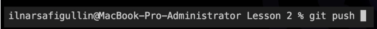
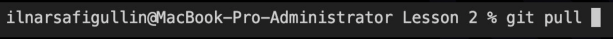

# ИНСТРУКЦИЯ ПО GIT

## 1. Проверка наличия установленного git

В терминале выполняем команду 

>**git version**

Если git установлен, то появится сообщение с информацией о версии файла, иначе будет сообщение об ошибке. 

## 2. Установка git

Для установки git необходимо[ загрузить последнюю версию с официального сайта](https://git-scm.com)

## 3. Настройка git  

При первом использовании git, необходимо представиться, для этого необходимо ввести две команды: 

>**git config --global user.name** 

>**git config --global user.email**

Для того, чтобы проверить регистрацию, в терминале выполняем команду: 

>**git config --list**

## 4. Инициализация репозитория

Для инициализации репозитория в терминале выполняем команду: 

>**git init**

В исходной папке появится скрытая папка **".git"**

## 5. Проверка состояния репозитория

Для проверки состояния в терминале выполняем команду: 

>**git status**

## 6. Добавление новой версии 

Для добавления версии, в терминале выполняем команду:

>**git add "name.md"**

Для удобства, после **add** можно использовать **"Tab"**

## 7. Сохранение новой версии

Для сохранения версии (коммита), в терминале выполняем команду:

>**git commit -m "..."**
 
В кавычках указываем комментарий 

## 8. Журнал версий

Для того, чтобы увидеть сохраненные версии, в терминале выполняем команду:

>**git log**

## 9. Просмотр изменений

Для просмотра разницы между текущим и сохраненным файлом, в терминале выполняем команду:

>**git diff**

## 10. Переключение между версиями

Для того, чтобы перейти к нужному коммиту, в терминале выполняем команду:

>**git checkout name_branche**

Где после **checkout** пишем название коммита/4 первых символа из названия

Для продолжения работы и возврата к рабочему файлу, в терминале выполняем команду:

>**git checkout master**

## 11. Добавление картинок и игнорирование файлов

Для того, чтобы разместить картинку в нашем файле, нужно добавить её в папку и после этого в нужном месте, пишем следующее: 

>****

Для того, чтобы удалить файлы с изображениями из отслеживания, нужно создать файл **" .gitignore "**

## 12. Ветвление

Для создания новой ветки, нужно ввести в терминале команду: 

>**git branch name_branch**

Ветвление, необходимо для работы с файлами в отдельной ветке, сохраняя при этом исходное состояние файла до их слияния. Чтобы отобразить созданные ветки, используется команда: 

>**git branch**

Чтобы перейти на другую ветку, используем команду: 

>**git checkout name_branche**

## 13. Слияние веток

Для слияния веток и внесения изменений в наш основной файл, используется команда: 

>**git merge name_branch**

Слияние делается в ту ветку, в которой мы находимся сейчас.

## 14. Конфликты

_Хочу увидеть конфликт_

_Тут точно должен быть конфликт_
_очень нужен конфликт_

_Хочу увидеть конфликт_

Конфликты возникают при слиянии двух веток в одну, при этом должна быть изменена одна и та же строка файле. 

**Конфликт выглядит вот так:**

## 15. Удаление веток

Для удаления ненужной ветки, используется команда: 

>**git branch -d name_branch**

## 16. Визуализация всех веток(*С конфликтом*)

_Ключ -graph в связке с коман..._

_тут должен быть конфликт._

## 16. Визуализация всех веток

Для визуализации всех веток в репозитории, используется команда:

>**git log --graph**

Ключ -graph в связке с командой log позволяет отобразить коммиты в виде дерева.

_**В данном случае конфликт выглядел так:**_

## 17. Клонированние внешного репозитория

Перед клонированием внешнего репозитория, локальный репозиторий не должен быть инициализирован в папке с текущим проектом. 

Для копирования используется команда:

>**git clone**

Команда не только загружает все изменения, но и пытается слить все ветки на локальном компьютере и в удаленном репозитории.

## 18. Переход в клонированную папку

Для продолжения работы в клонированном репозитории, необходимо перейти в эту папку. Для этого используется команда:

>**cd folder_name**

## 19. Отправка своей версии репозитория в удаленный репозиторий

Для этого необходимо использовать команду: 

>**git push**

При первом использовании команды необходимо сделать авторизацию.

## 20. Загрузка из удаленного репозитория в локальный

Для этого необходимо использовать команду:

> **git pull**

Команда автоматически выполнит **merge** с нашей веткой

## 21. Участие в проекте GitHub

Для того, чтобы участвовать в чужом проекте и предлагать свои изменения, необходимо: 

1. Сделать **fork** (ответление) репозитория
2. Сделать **git clone** своей версии репозитория
3. Создать новую ветку и в нее вносить свои изменения
4. Сделать коммиты
5. Отправить свою версию на GitHub
6. На сайте GitHub нажать кнопку **pull request**
