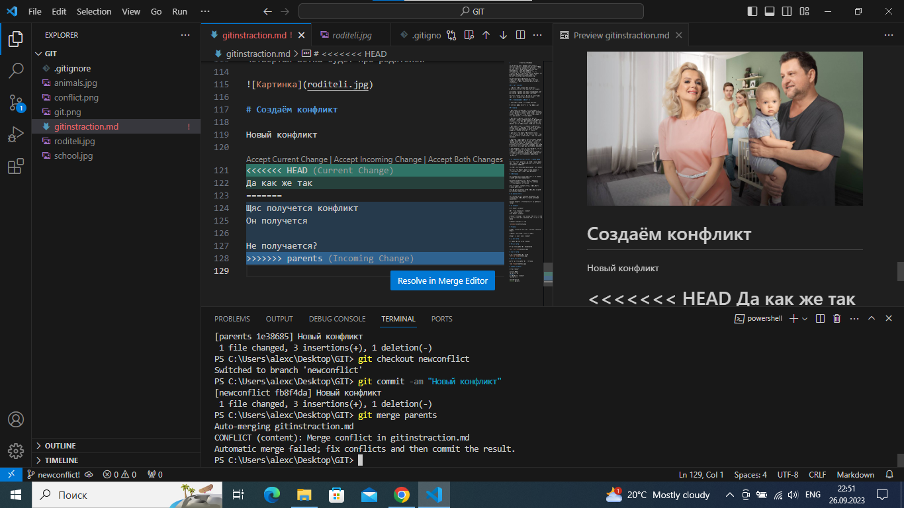

# Инструкция по Git

## 1.Проверка наличие установленого Git

В терминале выполняем команду git version.
Если Git установлен, то появится сообщение с информацией о версий файлаю.
Иначе будет сообщение об ошибке.

## 2. Установка Git

Загружаем последнюю версию с сайта

*              Установка в Windows

Для установки Git в Windows также имеется несколько способов. Официальная сборка доступна для скачивания на официальном сайте Git. Просто перейдите на страницу https://git-scm.com/download/win, и загрузка запустится автоматически. Обратите внимание, что это отдельный проект, называемый Git для Windows; для получения дополнительной информации о нём перейдите на https://gitforwindows.org.

Для автоматической установки вы можете использовать пакет Git Chocolatey. Обратите внимание, что пакет Chocolatey поддерживается сообществом.

## 3. Настройка Git

При первом использовании Git необходимо представиться, для этого надо весть 2 команды.

git config --global user.email "you@example.com"
git config --global user.name "Your Name"

Для того чтобы проверить прошла ли регистрация надо вести команду: git config --list

## 4. Инициализация Репозитория 

Прописываем команду в терминале git init.

В исходной папке появится скрытая папка .git

## Доамашка 

* git status - показывает состояния файлов в рабочем каталоге и индексе: какие файлы изменены, но не добавлены в индекс; какие ожидают коммита в индексе. Вдобавок к этому выводятся подсказки о том, как изменить состояние файлов.

* git add - добавляет содержимое рабочего каталога в индекс (staging area) для последующего коммита. По умолчанию git commit использует лишь этот индекс, так что вы можете использовать git add для сборки слепка вашего следующего коммита.

* git commit - берёт все данные, добавленные в индекс с помощью git add, и сохраняет их слепок во внутренней базе данных, а затем сдвигает указатель текущей ветки на этот слепок.

* git log - отображает отправленные снимки состояния и позволяет просматривать и фильтровать историю проекта, а также искать в ней конкретные изменения.

* git diff - используется для вычисления разницы между любыми двумя Git деревьями. Это может быть разница между вашей рабочей копией и индексом (собственно git diff), разница между индексом и последним коммитом (git diff --staged), или между любыми двумя коммитами (git diff master branchB).

* git checkout - можно не только получать старые коммиты и прежние версии файлов, но и осуществлять навигацию по существующим веткам. В сочетании с базовыми командами Git она позволяет сосредоточиться на определенном направлении разработки.

# 6. Добавление картинок и игнорирование файла

Для того чтобы разместить картинку в нашем файле надо добавить её в папку и после этого в нужном месте пишем слудуйшее: 

Для того чтоб удалить файлы с изображением с отслежевания надо создать файл gitignore.

# 7.Ветвление

Для создание новой ветки надо весть в терминале команду git branch name_branch

Ветвление необходимо для работы с файлами в отдельной ветке, сохраняя при этом исходное состояние файла до их слияние 

Чтоб отобразить созданые ветки, используется команда git branch 

Чтоб перейти на другую ветку используем команду git checkout name_branch.

# 8. Слияние веток

Для слияние веток и внесение изменение в наш основной файл используется команда git merge nam_branch.

Слияние делается в ту ветку в которой находимся сейчас.

# 9. Конфликт

Хочу увидеть конфликт

Тут  точно должен быть конфликт
Очень нужен конфликт
Хочу увидеть конфликт 

Конфликты возникают при слияние двух веток в одну при этом должны быть изменина одна и та же строка файла 

Конфликт выглядит вот так 

# Домашка 

Создать 4 ветки и слить их с основной, ветки не удалять 

Дополнить инструкцию своими скринами 

Сделать и решить ещё 1 конфликт

# Первая ветка 

Это будет первая ветка "vetka1"

# Вторая ветка 

Вторая ветка будет про animalworld

# Третья ветка 

Третья ветка будет про школу 

# Четвёртая ветка 

Четвёртая ветка будет про родителей 

# Создаём конфликт 

Новый конфликт 

Да как же так
Щяс получется конфликт
Он получется 

Не получается?

# Добавление новых инструкций

* Git push — это консольная команда, которая передаёт в удалённый репозиторий изменения, сделанные в локальном репозитории. С помощью этой консольной команды разработчики дорабатывают основную ветку, добавляя новые фичи и внося исправления найденных багов и уязвимостей.

* git clone — это утилита командной строки Git для выбора существующего репозитория и создания его клона, т. е. копии

* Pull request'ы позволяют вам рассказать другим о тех изменениях, которые вы разместили в своём GitHub-репозитории. Как только pull request отправлен, заинтересованные стороны рассматривают ваши изменения, обсуждают возможные правки или даже добавляют дополняющие коммиты, если нужно.

* В контексте GitHub, «fork» (создание ветвления проекта) просто означает создание ветвления проекта в собственном пространстве имён, что позволяет вносить публичные изменения и делать свой собственный вклад в более открытом виде.