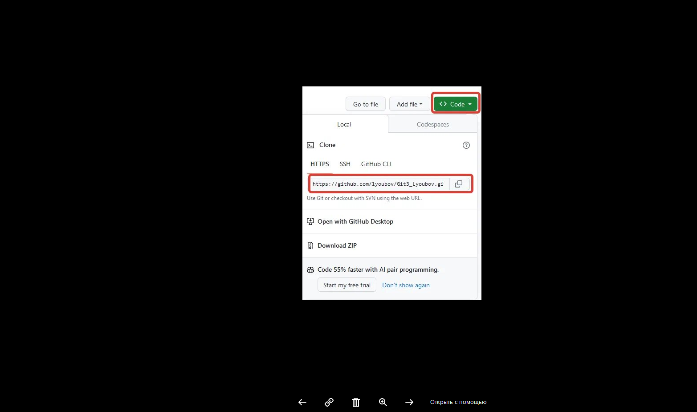

## 1. Создание локального репозитория

Чтобы вносить изменения в удалённый репозиторий нужен такой сервис как GitHub, там мы находим нужный нам репозиторий и нажимаем кнопку *Fork* 

чтобы скопировать этот репозиторий себе на страницу. 
После того как на нашей странице появляется копия нужного нам репозитория мы находим его в своих репозиториях и нажимаем скопировать ссылку на репозиторий 

 

Затем мы заходим в VSCode открываем пустую папку и вводим *git clone* и после этой команды вводим скопированную ссылку, нажимаем Enter и git скопирует репозиторий на компьютер. 

