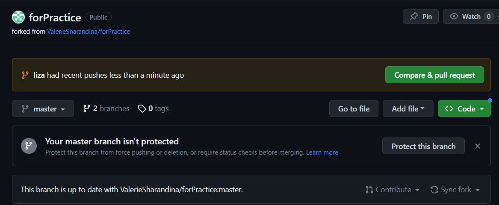

## 1. Создание локального репозитория

Чтобы вносить изменения в удалённый репозиторий нужен такой сервис как GitHub, там мы находим нужный нам репозиторий и нажимаем кнопку *Fork* 

чтобы скопировать этот репозиторий себе на страницу. 
После того как на нашей странице появляется копия нужного нам репозитория мы находим его в своих репозиториях и нажимаем скопировать ссылку на репозиторий 

 

Затем мы заходим в VSCode открываем пустую папку и вводим *git clone* и после этой команды вводим скопированную ссылку, нажимаем Enter и git скопирует репозиторий на компьютер. 

## 2. Создание своего репозитория на GitHub

Чтобы залить свой репозиторий на GitHub, нужно нажать кнопку новый репозиторий и после этого откроется вот такое окошко

В этом окне нужно ввести имя репозитория (Repository name) и затем нажать на кнопку создать репозиторий (create repository)

После этого GitHub покажет вот такое окно с инструкцией 

выбираем второй вариант и пошагово вводим все строчки в терминал VSCode 

После того как git проделал всю работу снова заходи на GitHub, обновляем страницу и видим вот такой результат

после того как мы создали версию нашего репозитория на GitHub, мы можем изпользовать команды *git push* чтобы перенести изменения из локального репозитория на GitHub, и *git pull* чтобы перенести изменения из GitHub на локальный репозиторий

После того как мы попытаемся закачать изменённую версию файла на GitHub появиться кнопка *compare and pull request* котороя позволит автору проекта увидить нашу версию и решить что с ней сделать

