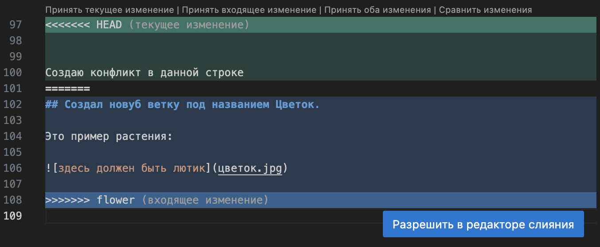
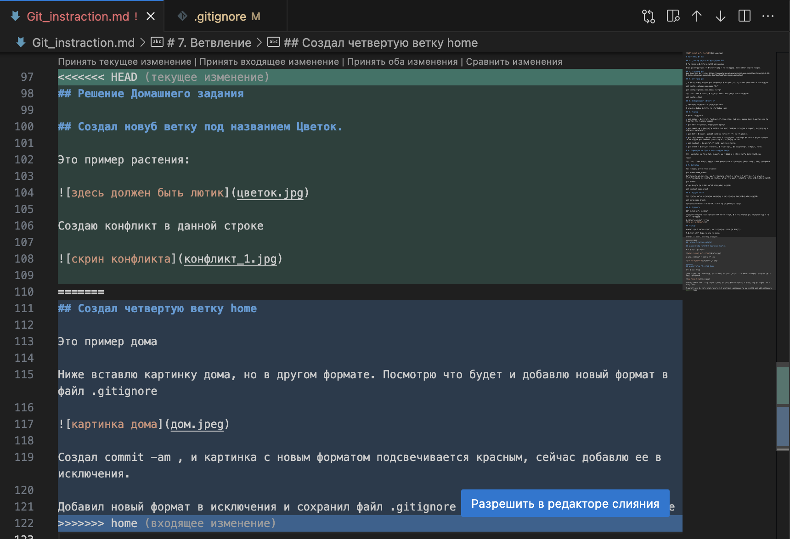

# Инструкция по Git

## 1. Проверка наличия установленного Git

В терминале выполняем команду git version 

Eсли git установлен, то появится инфа о версии файла. Иначе будет инфа об ошибке.

## 2. Установка git 
Загружаем git по ссылке: https://sourceforge.net/projects/git-osx-installer/files/git-2.33.0-intel-universal-mavericks.dmg/download?use_mirror=autoselect

## 3. Настройка git

При первом использовании git необходимо представиться, для этого нужно ввести две команды.

git config --global user.name "Имя"

git config --global user.email "Почта"

Для того чтобы проверить прошла ли регистрация нужно ввести команду: 

git config --list

## 4. Инициализация репозитория

Прописываем команду в терминале git init

В исходной папке появится скрытая папка .git

## 5. Домашка

*Описать команды:*

* git status - посмотреть текущее состояние ветки, например, какие файлы добавлены или не добавлены для создания commit

* git add - отслеживать добавленные файлы.

* git commit -m + ‘’комментарий’’ — сохранить текущее состояние и добавить комментарий к внесенным изменениям.

* git diff - показать разницу между версиями (то что не сохранено).

* git log - вызывать список действий и сохранений. Копировав первые 4 и более символов через команду git checkout можно откатить до нужной версии.

* git checkout - переключиться между разными версиями.

* git branch - позволяет создавать, просматривать, переименовывать и удалять ветки.

# 6. Добавление картинок и игнорирование файлов

для размещения картинок надо добавить ее в папку и в нудном месте пишем следующее 

Для того, чтобы удалить файлы с изображениями из отследивания нужно создать файл .gitignore

# 7. Ветвление

Для создания новой ветки команда:

git brancn name_branch

Ветвление необходимо для работы с файлами отдельной ветке, сохраняя при этом исходное состояние файла до момента их слияния. Чтобы отобразить созданные ветки, используем команду:

git branch

Чтобы перейти на другую ветку используем команду:

git checkout name_branch

## 8. Слияние веток

Для слияния веток и внесение изменений в наш основной файл используем команду:

git merge name_branch

Слияние происходит в ту ветку, в которой мы находимся сейчас.

## 9. Конфликты

Тут должен быть конфликт

Конфликты возникают при слиянии двух веток в одну, при этом должна быть изменена одна и та же строка файла.

Конфликт выглядит вот так

## Домашка

Создать еще 2 ветки и слить их с основной. ветки не удалять. 

Дополнить инструкцию своими скринами. 

Создать и решить еще один конфликт.

## Решение Домашнего задания

## Создал третью ветку под названием flower

Это пример растения: 

Создаю конфликт в данной строке

## Создал четвертую ветку home

Это пример дома

Ниже вставлю картинку дома, но в другом формате. Посмотрю что будет и добавлю новый формат в файл .gitignore

Создал commit -am , и картинка с новым форматом подсвечивается красным, сейчас добавлю ее в исключения.

Добавил новый формат в исключения и сохранил файл .gitignore через команду git add .gitignore

После чего решил слить ветку home в ветку master и образовался конфликт. Я сохранил оба варианта.

Это скрин конфликта:

## Инструкция по копированию чужого проекта и отправке хозяину проекта наших изменений.

1. Делаем (fork) интересующего нас чужого репозитория. Снимаем галочку с master, чтоб все ветки скопировать.
2. Копирую ссылку у себя в профиле гитхаб этого репозитория (Code - копия) и делаю (git clone) в терминале VS Code.
3. cd название новой папки или правой кнопкой мыши по папке в проводнике и «Открыть во встроенном терминале».
4. Создаем новую ветку с предлагаемыми изменениями и работаем только в ней.
5. Отправляем эти изменения на свой аккаунт гитхаб (push).
6. В Гитхаб появляется измененный нами репозиторий с новой веткой. Мы можем отправить его хозяину проекта через следующие кнопки: contribute - open pull request (создаем комментарий) - create pull request

## Команды для работы с удаленным репозиторием

* git clone ссылка — копируем удаленный репозиторий к себе локально первый раз.

* cd название папки — после клонирования создалась новая папка внутри репозитория, git не понимает, что скопированный файл это наш новый репозиторий, этой командой мы указываем путь к новому репозиторию.

* git push — отправляем все внесенные изменения в свой удаленный репозиторий github. Для корректной работы этой команды мы должны были ранее создать файл репозитория на github через + (вверху справа), далее по инструкции сайта копируем 3 команды в терминал. Если мы работаем с Fork, предыдущий пункт не делаем.

* git pull — подтягиваем все изменения в наш локальный репозиторий из удаленного.
