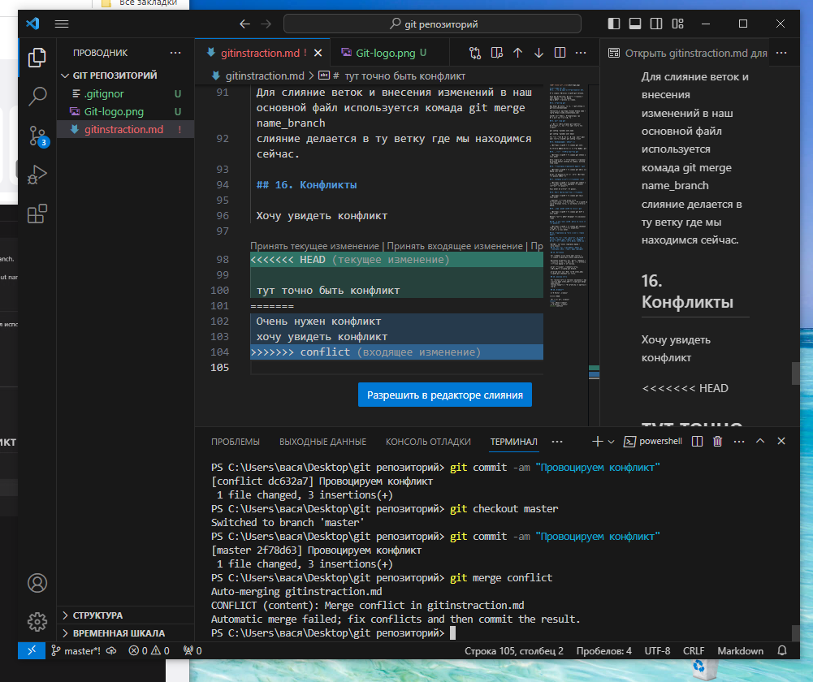
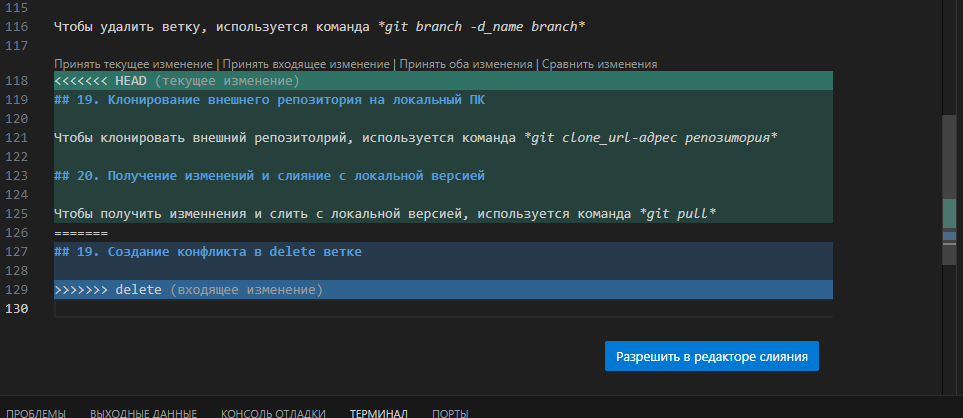

# Инструкция по Git
## 1. Проверка наличия установленного Git.

В терминале выполняем команду git version.

Если git установлен, появится сообщение с информацией о версии файла.
Иначе будет сообщение об ошибке.

## 2. Установка git

Загружаем последнию версию с сайта https://git-scm.com/downloads

Дополнительно загружаем Visual Studio Code с сайта https://code.visualstudio.com/

Следуя инструкциям, устанавливаем обе программы на свой компьютер.

## 3. Настройка git

При первом использовании git небходимо представиться, для этого надо ввести две команды:

git config --global user.name

git config --global user email

Для того чтобы проверить прошла регистрация надо ввести команду: **git config --list**

## 4. Инициализация Репозитория

Прописываем команду в терминале **git init**.

В исходной папке появиться скрытая папка (.git)

## 5. Просмотр статуса действий git

Прописываем команду в терминале **git status** и жмем enter

Если ошибок нет, то высвечивается сообщение: (On branch master nothing to commit, working tree clean)

## 6. Отслеживание добавленных файлов в git

Прописываем команду в терминале **git add** и имя файла жмем enter

Чтобы сохранение прошло корректно описываем сохранение (пункт 7)

## 7. Создание коммитов (сохранений) в git

Прописываем команду в терминале **git commit** и в сообщении описываем название сохранения (-m"текст сохранения") 

Жмем enter происходит сохранения.

## 8. Вызов списка действий и сохранений

Прописываем команду в терминале **git log** и жмем enter

Показывает состояние более новых
версий проекта. Но если вызвать эту команду из
самой «свежей» ветки, мы не увидим исходного
файла.

## 9. Показ раницы между версиями в git.

Прописываем команду в терминале **git diff** и жмем enter

Зеленым текстом будет показаны все изменения в git

## 10. Переключения между версиями (в сохранениях)

Прописываем команду в терминале **git checkout** выбираем версию в которую необходимо вернуться и жмем enter.

## 11. Добавление картинок и игнорирование файлов

## 12. Для того чтобы разместить картинку в исходном файле надо добавить ее в папку и после этого в нужном месте пишем следующее :

 ## 13. Для того чтобы удалить файлы из ослеживания нужно создать файл (.gitignor)

 ## 14. Ветвление

 Для создания новой ветки надо ввести в терминале команду **git branch name_branch**

 Ветвление необходимо для работы с файлами в отдельной ветке, сохраняя при этом исходное состояние файла до их слияний.

 Чтобы оттобразить созданные ветки, используется команда **git branch**.

 ## 15. Слияние веток

 Для слияние веток и внесения изменений в наш основной файл используется комада git merge name_branch
 слияние делается в ту ветку где мы находимся сейчас.

 ## 16. Конфликты

 Конфликты возникают при слиянии двух веток в одну при этом должна быть изменена одна и та же строка файла

 Конфликт выглядит вот так (на уроке)

 

 И вот так (домашнее задание)

 

 ## 17. Переход на другую ветку

 Чтобы перейти на другую ветку, используется команда **git checkout_name branch**

## 18. Удаление ветки

Чтобы удалить ветку, используется команда **git branch -d_name branch** 

## 19. Клонирование внешнего репозитория на локальный ПК

Чтобы клонировать внешний репозитолрий, используется команда **git clone_url-адрес репозитория**

## 20. Получение изменений и слияние с локальной версией

Чтобы получить изменнения и слить с локальной версией, используется команда **git pull**

## 21. Отправление локальной версии репозитория на внешний

Чтобы отправить локальную версию в интернет, используется команда **git push**

## 22. Вызов списка действий и сохранений ввиде графика веток

Чтобы вывести график веток, используется команда **git log --graph**.
