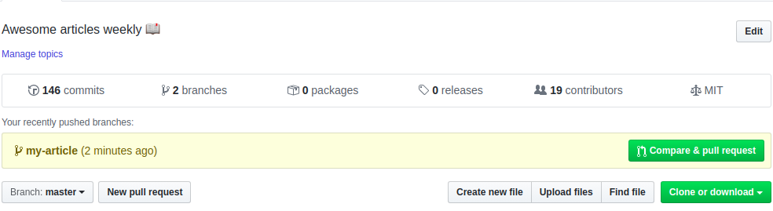

## Инструкция по работе с Git


### 1. **Установка**
    
1.1 Проверка установки Git
   
* Чтобы проверить, установлена ли система Git и какую версию вы используете, откройте окно терминала в Linux или Mac или окно командной строки в Windows и введите следующую команду:
        
  ```
   git --version 
   ```
         
* Если Git не установлен, вы получите подобное сообщение об ошибке:
   
   ```
   -bash: git: command not found
   'git' is not recognized as an internal or external command, operable program or batch file.
   ```
   В таком случае вы должны установить Git на свой компьютер. Ниже мы рассмотрим установку Git в нескольких основных операционных системах.
   
1.2 Установка Git на Linux
            
* Установка Git в Ubuntu 16.04 или Debian 8
  ```
  sudo apt-get update
  sudo apt-get install git
  ```
  После установки вы можете перейти к разделу «Настройка Git».
* Установка Git на Windows
     
  [Git для Windows](http://git-scm.com/download/win)

### 2. Настройка Git

Теперь, когда вы установили Git на свою машину, вам нужно настроить систему, чтобы сообщения о коммитах содержали правильную информацию о вас.

Самый простой способ сделать это – выполнить команду git config. Вам нужно предоставить имя и адрес электронной почты, потому что Git вставляет эту информацию в каждый коммит. Чтобы добавить эту информацию, введите:

```
git config --global user.name "Имя"
git config --global user.email "Адресс электронной почты"
```

Увидеть все элементы конфигурации можно с помощью команды:

```
git config --list
user.name=Your Name
user.email=youremail@domain.com
```

### 3. Создание пространства для проекта
* Чтобы управлять изменениями в тексте, нужно создать локальный репозиторий Git. Git-репозиторий должен находиться внутри существующего каталога, поэтому сначала мы создадим отдельный каталог

```
mkdir [имя папки на латинице]
```

* Переходим в каталог:
```
cd [имя папки]
```

* С помощью команды git init создайте в текущем каталоге новый пустой репозиторий Git:
```
git init
```
### 4. Полезные команды
* Файл .gitignore позволяет задать файлы, которые Git следует игнорировать. Вы можете использовать этот файл, чтобы игнорировать временные файлы, которые создает текстовый редактор, или файлы операционной системы. Например, в macOS приложение Finder создает в каталогах файлы .DS_Store. Создайте файл .gitignore, который будет их игнорировать:
```
.gitignore
```
* Команда git status покажет вам состояние вашего репозитория. С ее помощью можно узнать, какие файлы нужно добавить, чтобы Git мог их отслеживать. Запустите эту команду:
```
git status
```
* Чтобы Git мог следить за изменениями в файлах. Используйте команду git add, чтобы сделать это:
```
git add [имя файла]
```
* Используйте команду git commit для фиксации ваших изменений:
```
git commit -m "[Текст комита]"
```

* С помощью git diff вы можете увидеть изменения в файлах:
```
git diff [имя файла]
```

В выводе есть строки, начинающиеся со знака плюс (+). Это добавленные вами строки. Удаленные строки будут отображаться со знаком минус (-). Строки, которые остались без изменений, будут без каких-либо символов.

Команды git diff и git status позволяют вам узнать, что вы изменили в тексте. Вы также можете сохранить разницу в файл, чтобы просмотреть его позже. Это делается с помощью следующей команды:

```
git diff [имя файла] > [имя временного файла].diff
```
Расширение .diff позволит текстовому редактору применить правильную подсветку синтаксиса.

### 5. Управление версиями и изменениями
* Команда ***git log*** показывает историю изменений вашего репозитория. Каждое внесенное вами изменение имеет запись в журнале.

* Каждый коммит имеет определенный идентификатор. Этот номер используется для ссылки на данный коммит. Для ссылки вам нужны только первые несколько символов идентификатора. Команда ***git log –oneline*** выдает сокращенную версию лога с более короткими идентификаторами

* Чтобы просмотреть исходную версию файла, используйте git show и идентификатор коммита. Идентификаторы в вашем репозитории будут отличаться от идентификаторов в наших примерах.
```
git show [индификатор комита] [имя файла]
```
#### Создание конфликта и решение


### 6. Полезные команды

#### Получение и создание проектов

| Command                                                           | Описание                                      |
|-------------------------------------------------------------------|-----------------------------------------------|
| `git init`                                                        | Инициализация локального репозитория Git|
| `git clone ssh://git@github.com/[username]/[имя репозитория].git` | Создать локальную копию удаленного репозитория |

#### Базовые комманды

| Command                           | Описание                                                   |
|-----------------------------------|------------------------------------------------------------|
| `git status`                      | Проверить статус                                           |
| `git add [имя файла]`             | Добавьте файл в область подготовки                         |
| `git add -A`                      | Добавьте все новые и измененные файлы в область подготовки |
| `git commit -m "[текст коммита]"` | Создать Commit                                             |
| `git rm -r [имя файла/папки]`     | Удаление файла (или папки)                                 |

#### Ветвление и слияние

| Command                                              | Описание                                               |
|------------------------------------------------------|--------------------------------------------------------|
| `git branch`                                         | Список веток (звездочка обозначает текущую ветку)      |
| `git branch -a`                                      | Список всех филиалов (локальных и удаленных)           |
| `git branch [имя ветки]`                             | Создать новую ветку                                    |
| `git branch -d [имя ветки]`                          | Удалить ветку                                          |
| `git push origin --delete [имя ветки]`               | Удалить удаленную ветку                                |
| `git checkout -b [имя ветки]`                        | Создать новую ветку и переключиться на нее             |
| `git checkout -b [имя ветки] origin/[имя ветки]`     | Клонировать удаленную ветку и переключиться на нее     |
| `git branch -m [старое имя ветки] [новое имя ветки]` | Переименовать локальную ветку                          |
| `git checkout [имя ветки]`                           | Перейти на ветку                                       |
| `git checkout -`                                     | Переключиться на ветку, которую последний раз проверил |
| `git checkout -- [имя файла]`                        | Отменить изменения в файле                             |
| `git merge [имя ветки]`                              | Объединить ветку с активной веткой                     |
| `git merge [исходная ветка] [целевая ветка]`         | Слить ветку в целевую ветку                            |
| `git stash`                                          | Спрятать изменения в грязном рабочем каталоге          |
| `git stash clear`                                    | Удалить все спрятанные записи                          |

#### Общий доступ к проектам и их обновление

| Command                                                                           | Описание                                                        |
|-----------------------------------------------------------------------------------|-----------------------------------------------------------------|
| `git push origin [название ветки]`                                                | Отправить ветку в удаленный репозиторий                         |
| `git push -u origin [название ветки]`                                             | Отправьте изменения в удаленный репозиторий (и запомните ветку) |
| `git push`                                                                        | Отправить изменения в удаленный репозиторий (запомненная ветка) |
| `git push origin --delete [название ветки]`                                       | Удалить удаленную ветку                                         |
| `git pull`                                                                        | Обновите локальный репозиторий до последней фиксации            |
| `git pull origin [название ветки]`                                                | Извлечь изменения из удаленного репозитория                     |
| `git remote add origin ssh://git@github.com/[username]/[имя репозитория].git`     | Добавить удаленный репозиторий                                  |
| `git remote set-url origin ssh://git@github.com/[username]/[имя репозитория].git` | Установите исходную ветвь репозитория на SSH                    |

#### Проверка и сравнение

| Command                                     | Описание                                           |
|---------------------------------------------|----------------------------------------------------|
| `git log`                                   | Посмотреть изменения                               |
| `git log --summary`                         | Посмотреть изменения (подробно)                    |
| `git log --oneline`                         | Просмотр изменений (кратко)                        |
| `git diff [исходная ветка] [целевая ветка]` | Предварительный просмотр изменений перед слиянием  |

### 7. Работа с пул-реквестом
1. Форк репозитория
   * Чтобы сделать форк репозитория, нужно нажать кнопку «Fork» в верху страницы. Таким образом вы создадите экземпляр всего этого репозитория в своем аккаунте.
  
   

2. Клонирование репозитория

   * Когда репозиторий уже есть в вашем аккаунте, вы можете клонировать его на свою машину и в дальнейшем работать с ним локально.

   * Чтобы клонировать репозиторий, нажмите кнопку «clone» и скопируйте ссылку.

   
   * Откройте терминал и запустите следующую команду. С ее помощью репозиторий будет клонирован на вашу машину.
    ```
    git clone [HTTPS ADDRESS]
    ```
    * Теперь у вас есть копия ветки master основного онлайн-репозитория проекта.
  
    * Переходим в клонированную директорию:
    ```cd [NAME OF REPOSITORY]```

3. Создание ветки

   * При работе с репозиторием хорошей практикой считается создание отдельной ветки для внесения изменений, причем это не зависит от размеров проекта.

   * Имя ветки должно быть коротким и отражать те изменения, которые вы вносите.

   * Создадим ветку при помощи команды git checkout:

    ```
    git checkout -b [Имя ветки]
    ```
4. Внесение изменений и коммит

   * Внесите необходимы изменения в проект и сохраните их. Затем запустите команду ``git status``: вы увидите внесенные изменения.

   * Добавьте эти изменения в только что созданную ветку при помощи команды ``git add``:

   * Теперь вы можете сделать коммит этих изменений при помощи команды ``git commit``:

5. Отправка изменений на GitHub

  * Чтобы отправить изменения на GitHub (сделать push), нужно определить имя удаленного репозитория.
  `git remote`
  * После определения имени можно безопасно отправить изменения на GitHub.
  `git push origin [имя ветки]`

6. Создание пул-реквеста
    * Перейдите в свой репозиторий на GitHub. Там есть кнопка «Compare & pull request» — кликните ее.
    
    * Введите необходимые детали относительно того, что именно вы сделали (чтобы поставить ссылку на issues, возмользуйтесь знаком «решетки»). После этого можно нажать кнопку подтверждения внизу.
   